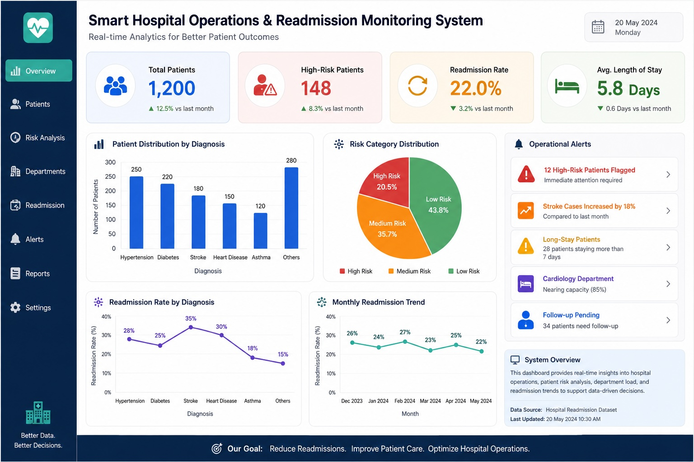
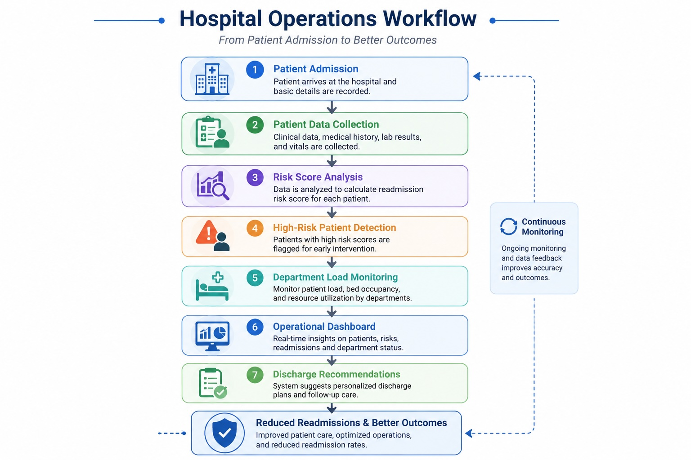

# Smart Hospital Operations & Readmission Monitoring System

## Overview

This project is a prototype healthcare operations system designed to analyze hospital patient data, identify high-risk readmission cases, monitor operational trends, and support data-driven healthcare decision-making.

The system combines Python-based analytics, SQL-based operational reporting, and dashboard-style monitoring concepts to simulate a real-world hospital operations workflow.

---

## Features

- Patient risk segmentation system
- Readmission risk analysis
- Diagnosis-level operational monitoring
- SQL-based healthcare reporting
- Data visualization and operational insights
- Prototype dashboard workflow
- High-risk patient identification system

---

## Technologies Used

- Python
- SQL (SQLite)
- Pandas
- Matplotlib
- Google Colab
- GitHub

---

## Dashboard Preview

---

## Workflow Diagram

---

## Operational Insights

- Certain diagnoses showed significantly higher readmission probability.
- High-risk patients were strongly associated with longer hospital stays.
- Operational load varied considerably across diagnosis categories.
- SQL-based reporting workflows helped simulate operational monitoring systems.

---

## Conclusion

The project demonstrates how healthcare analytics, SQL-based reporting, and operational monitoring can be integrated into a prototype hospital operations system capable of supporting data-driven healthcare decisions and improving patient outcomes.
